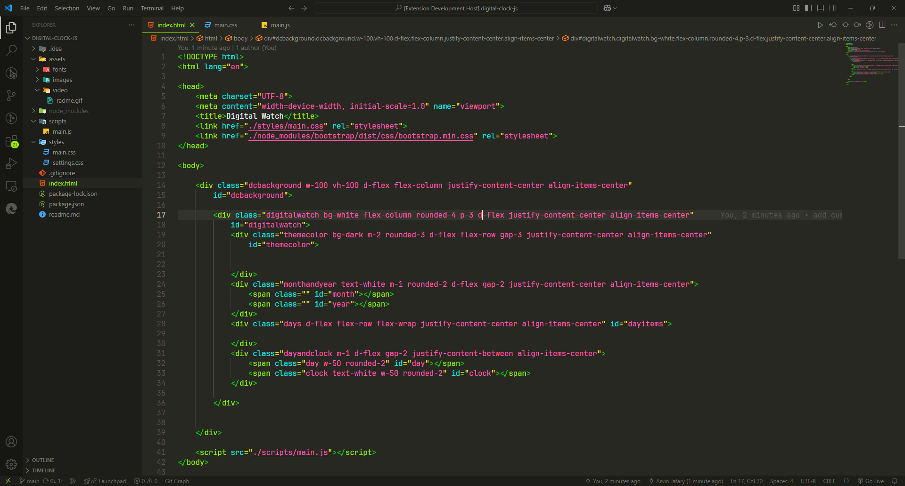
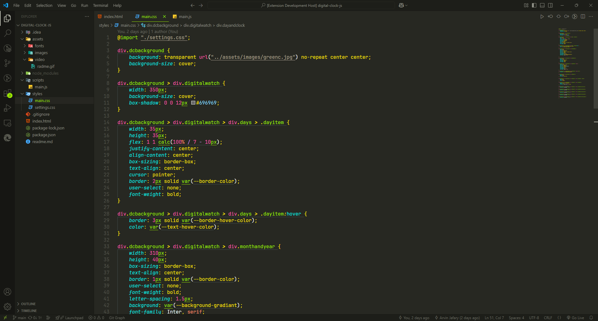
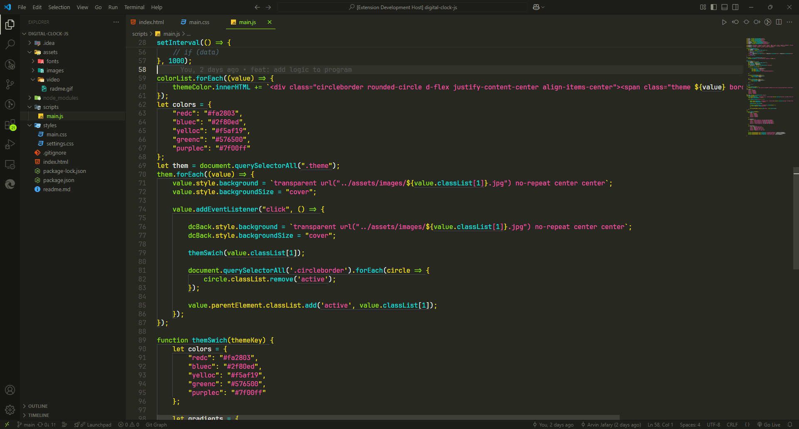

<div align="center">

# 🌌 Arwinux Galaxy

**A futuristic, galaxy-inspired dark theme for Visual Studio Code featuring neon accents and cosmic contrast.**

[](https://github.com/arwinux/arwinux-galaxy)
[](LICENSE)
[](https://marketplace.visualstudio.com/)

_Transform your coding environment into a cosmic experience_

</div>

## 🎨 Preview

### HTML


_Semantic HTML structures with enhanced clarity and precise differentiation of tags and attributes_

### CSS


_CSS properties, selectors, and values with distinct chromatic assignments_

### JavaScript


_Modern JavaScript syntax highlighting with clear function and parameter distinction_

---

## ✨ Features

- **🌌 Cosmic Design** - Immerse yourself in a stellar galaxy-inspired interface that transforms your coding environment
- **👁️ Optimal Readability** - Carefully selected color palette ensures sustained clarity and vibrancy during extended coding sessions
- **🎯 Monokai-Inspired** - Built upon the foundation of the widely recognized Monokai Classic theme with a celestial twist
- **🌍 Extensive Language Support** - Comprehensive syntax highlighting for HTML, CSS, JavaScript/TypeScript (including JSX/TSX), Python, PHP, Ruby, Go, Rust, C#, Java, SQL, JSON, and Markdown

---

## 🎨 Color Palette

The **Arwinux Galaxy** theme features a distinctive cosmic color scheme with `#272822` as the foundational background color, known as "Deep Void."

| Color Name           | Hex Code  | Preview                                                                                        |
| -------------------- | --------- | ---------------------------------------------------------------------------------------------- |
| **Galactic Green**   | `#9BEC00` |  |
| **Nebula Turquoise** | `#00ECE4` |  |
| **Solar Flare**      | `#FFE600` |  |
| **Stellar Pink**     | `#FF5BAE` |  |
| **Astro Violet**     | `#AE81FF` |  |
| **Deep Void**        | `#272822` |  |

_Additional cosmic hues are integrated throughout the theme's configuration to create a harmonious and immersive experience._

---

## 🚀 Installation

### From VS Code Marketplace

1. Open VS Code
2. Go to Extensions (`Ctrl+Shift+X` / `Cmd+Shift+X`)
3. Search for "Arwinux Galaxy"
4. Click **Install**

### Manual Installation

1. Clone this repository:
   ```bash
   git clone https://github.com/arwinux/arwinux-galaxy.git
   ```
2. Copy the folder to your VS Code extensions directory:
   - **Windows**: `%USERPROFILE%\.vscode\extensions\`
   - **macOS**: `~/.vscode/extensions/`
   - **Linux**: `~/.vscode/extensions/`
3. Restart VS Code
4. Select **Arwinux Galaxy** from the theme picker (`Ctrl+K Ctrl+T` / `Cmd+K Cmd+T`)

---

## ⚙️ Customization

To customize the theme:

1. Navigate to `themes/Arwinux Galaxy-color-theme.json`
2. Modify color values or other parameters as desired
3. Restart VS Code to apply changes

For more information on customizing color themes, refer to the [VS Code Color Theme documentation](https://code.visualstudio.com/api/extension-guides/color-theme).

---

## 🤝 Contributing

Contributions are welcome! To contribute:

1. Fork the repository
2. Create a feature branch: `git checkout -b feature/YourFeature`
3. Commit your changes: `git commit -m 'Add some feature'`
4. Push to the branch: `git push origin feature/YourFeature`
5. Submit a pull request with a detailed description of your changes

Please ensure your contributions align with the project's coding style and include relevant documentation.

---

## 📝 License

This project is licensed under the MIT License - see the [LICENSE](LICENSE) file for details.

---

## 👤 Author

**arwinux**

- GitHub: [@arwinux](https://github.com/arwinux)
- Repository: [arwinux-galaxy](https://github.com/arwinux/arwinux-galaxy)

---

<div align="center">

**Start coding with Arwinux Galaxy and let your creativity reach cosmic heights! 🚀**

Made with ❤️ by [arwinux](https://github.com/arwinux)

</div>
